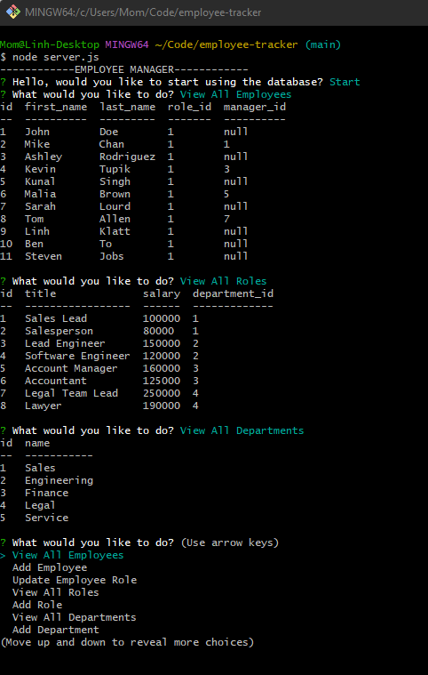

# employee-tracker

## Description

Employee tracker is a tool written in JavaScript that helps organizations keep track of their employees. It allows users to enter and store information about each employee including their department, job title, salary. The JavaScript code interacts with the MySQL database to retrieve and update employee data as needed.

## Table of Contents

- [Description](#description)
- [Usage](#usage)
- [Questions](#question)

## Usage

Please refer to my video for the usage.

This is the link to my video : https://drive.google.com/file/d/1OpCuSHckfn_i6LexoI1VADr2aJsvzENk/view

This shows the layout of my application.

## Question

If you have any questions about the repo, open and issue or contact me directly at linhklatt@yahoo.com. You can find more of my works at [linhklatt](email)
